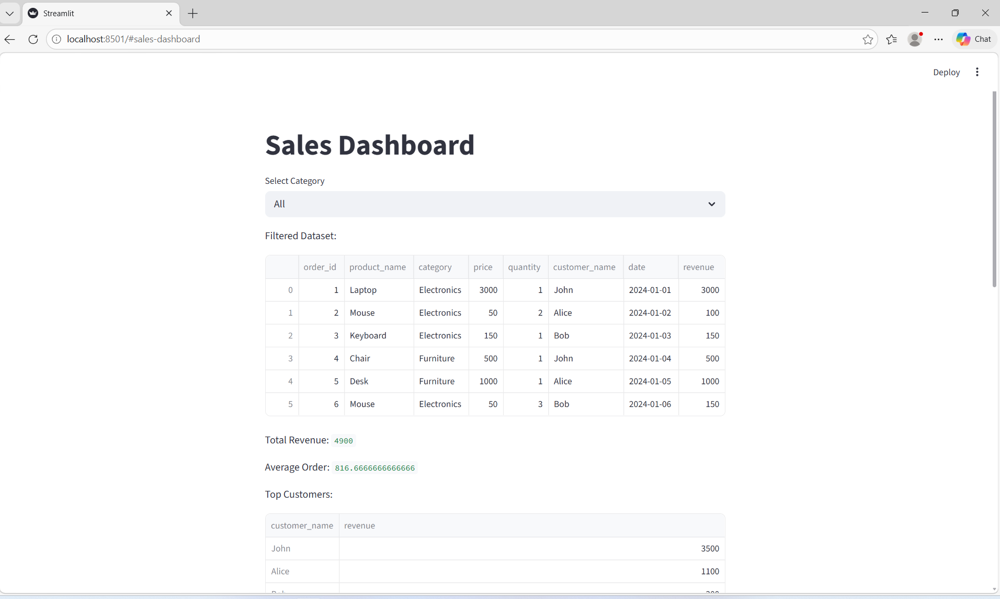
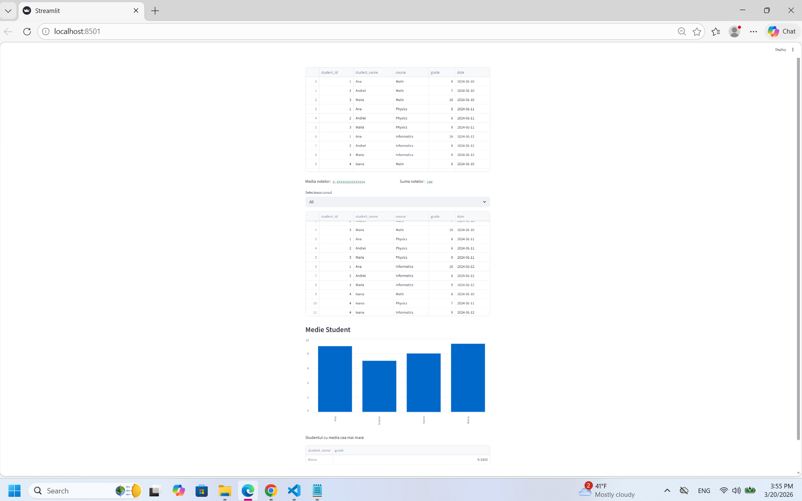
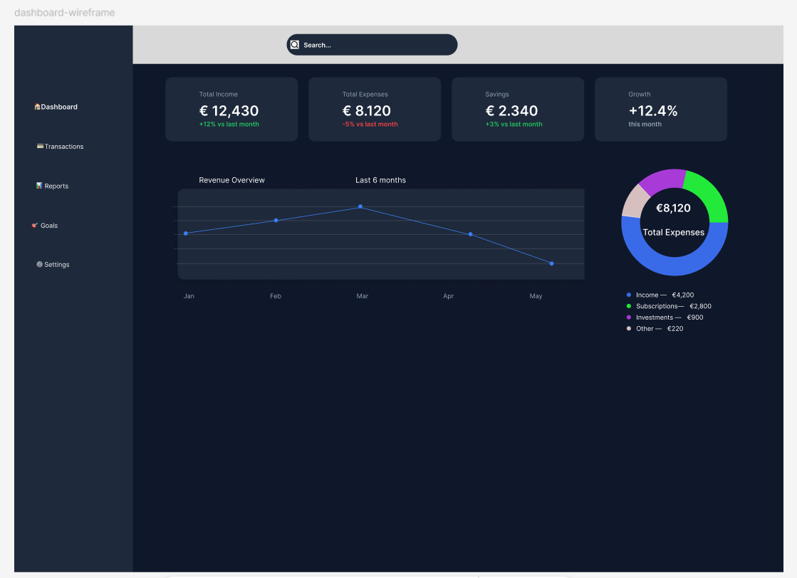

# 💼 Portofoliu Proiecte – Andreea Minodora

Bun venit în portofoliul meu de proiecte!
Acest repository conține proiecte dezvoltate în timpul studiilor și în proiecte personale, în domenii precum **Data Analysis, Software Development, Web Development și UI Design**.

---

# 📊 Proiecte

---

## 📊 Sales Dashboard (Python)

Dashboard interactiv realizat în **Python** folosind **Pandas și Streamlit** pentru analiza datelor de vânzări.

### 🔍 Funcționalități:

* calcul Total Revenue
* Average Order Value
* număr total de comenzi
* Top produse
* Top clienți
* filtru interactiv pe categorie

### 🛠️ Tehnologii:

Python, Pandas, Streamlit

---
## 📊 Student Grades Dashboard (Python)

Dashboard interactiv realizat în Python pentru analiza notelor studenților.

**Funcționalități:**

* calcularea mediei notelor
* filtrare după curs
* grafic pentru media pe student
* identificarea celui mai bun student

**Tehnologii:**

* Python
* Pandas
* Streamlit

📎 Vezi proiectul:  
https://github.com/Andreea-Minodora/portofoliu/tree/main/python-student-dashboard-analysis

---

## 📈 Road Accident Analysis Dashboard (Power BI)

Dashboard interactiv realizat în **Power BI** pentru analiza accidentelor rutiere din Marea Britanie.

### 🔍 Funcționalități:

* analiză frecvență accidente
* distribuție geografică
* analiză severitate

### 🛠️ Tehnologii:

Power BI, Data Visualization

---

## 🎨 Finance Dashboard UI (Figma)

Design de dashboard financiar realizat în **Figma**, cu focus pe UI modern și claritate vizuală.

### 🔍 Funcționalități:

* carduri KPI
* grafic venituri
* diagramă cheltuieli
* layout dashboard modern

### 🛠️ Instrument:

Figma

🔗 [Vezi proiectul în Figma](https://www.figma.com/design/VMr4WsTWh08nTSjh8fvUEd/Finance-SaaS-Dashboard?node-id=3-78&t=zGSwZBYKVUQ1az4L-1)

---

## 🌐 Hotel Website (HTML & CSS)

Site web realizat folosind **HTML și CSS** pentru prezentarea unui hotel.

### 🔍 Funcționalități:

* prezentare hotel
* camere și prețuri
* restaurant și facilități
* formular de rezervare

### 🛠️ Tehnologii:

HTML, CSS

---

## 💻 Catalog de Note (C# Windows Forms)

Aplicație desktop realizată în **C#** pentru gestionarea studenților și a notelor.

### 🔍 Funcționalități:

* administrare studenți
* gestionare note
* calcul medii
* export CSV

### 🛠️ Tehnologii:

C#, .NET, SQL Server

---

# 🧮 Proiecte SQL

## 🛒 SQL Online Store Analysis

* bază de date relațională
* relații între tabele
* analize vânzări

## 🎓 SQL Student Performance Analysis

* medii studenți
* top performanță
* analiză cursuri

## 📊 SQL Sales Analysis

* venit total
* vânzări pe produs
* top clienți
* valoare comenzi

### 🛠️ Tehnologii:

SQL, PostgreSQL

---

# 🛠️ Tehnologii utilizate

* Python
* Pandas
* Streamlit
* SQL (PostgreSQL)
* Power BI
* C# / .NET
* HTML & CSS
* Figma
* Data Visualization

---

# 👩‍💻 Autor

**Andreea Minodora**
🔗 https://github.com/Andreea-Minodora
