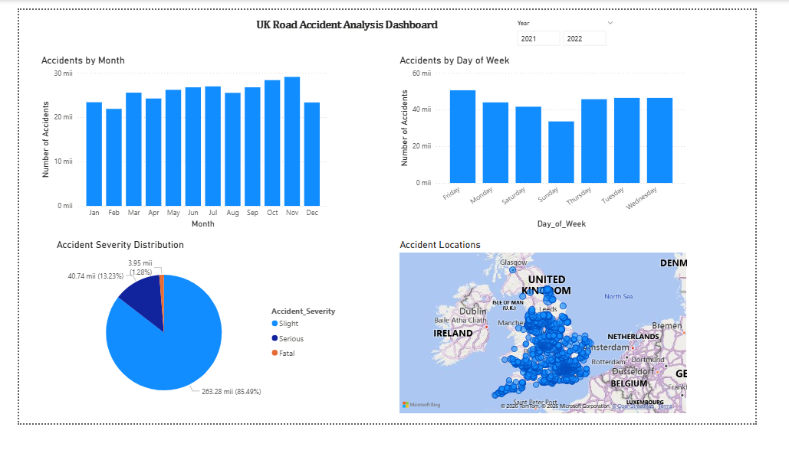

# Portofoliu de Proiecte

Bun venit în portofoliul meu de proiecte!
Acest repository conține proiecte realizate în timpul studiilor și în proiecte personale, în domenii precum **analiza de date, dezvoltare software, web development și UI design**.

---

## Proiecte

### Road Accident Analysis Dashboard (Power BI)

Dashboard interactiv realizat în **Power BI** pentru analiza accidentelor rutiere din Marea Britanie.
Proiectul permite explorarea datelor și identificarea tiparelor privind frecvența accidentelor, severitatea și distribuția geografică.

**Tehnologii:**
Power BI, Data Visualization, Exploratory Data Analysis

---

### Finance Dashboard UI (Figma)

Design de **dashboard financiar** realizat în **Figma**, care prezintă indicatori financiari într-o interfață modernă și intuitivă.

**Caracteristici:**

* carduri pentru indicatori financiari
* grafic de evoluție a veniturilor
* diagramă pentru distribuția cheltuielilor
* layout modern pentru dashboard

**Instrument:**
Figma

---

### Hotel Website (HTML & CSS)

Site web realizat folosind **HTML și CSS** pentru prezentarea unui hotel și realizarea rezervărilor online.

**Funcționalități:**

* prezentarea hotelului
* camere și prețuri
* restaurant și facilități
* formular de rezervare
* pagini multiple cu navigare

**Tehnologii:**
HTML, CSS

---

### Catalog de Note (C# Windows Forms)

Aplicație desktop realizată în **C# (Windows Forms)** pentru gestionarea studenților și a notelor într-un catalog.

**Funcționalități:**

* administrarea studenților
* administrarea disciplinelor
* gestionarea notelor
* calcularea mediei
* afișarea situației studentului
* exportul datelor în CSV

**Tehnologii:**
C#, .NET, Windows Forms, SQL Server

---

## Tehnologii utilizate

În cadrul acestor proiecte am folosit:

* Power BI
* C#
* .NET
* SQL Server
* HTML
* CSS
* Figma
* Data Visualization

---

## Autor

Andreea Minodora
GitHub: https://github.com/Andreea-Minodora
