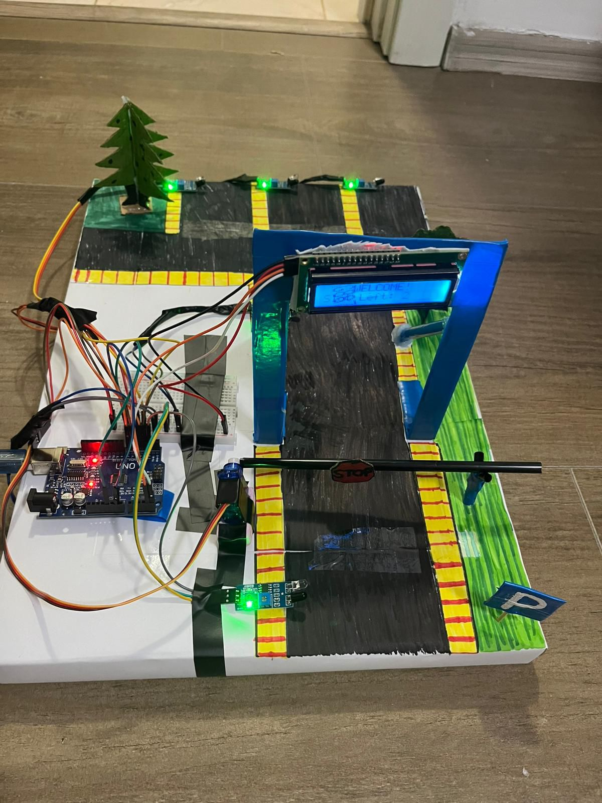

# Sistem de barieră automată pentru parcare (Arduino)

## 📌 Descriere
Acest proiect constă într-un sistem de barieră automată pentru controlul accesului într-o parcare.

## ⚙️ Funcționalități
- Detectarea mașinii cu senzori
- Deschiderea automată a barierei
- Închiderea după trecerea mașinii
- Gestionarea locurilor disponibile

## 🔧 Componente
- Arduino
- Senzor (ultrasonic / IR)
- Servo / motor
- Alimentare

## 🧠 Cum funcționează
Când o mașină este detectată, bariera se deschide automat. După ce mașina trece, bariera se închide.

## 📷 Imagine

## 🎥 Demo
[
