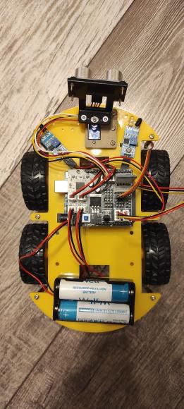

# Robot controlat vocal cu evitare de obstacole (Arduino)

## 📌 Descriere

Acest proiect constă într-un robot bazat pe Arduino, controlat prin comenzi vocale.
Robotul poate executa mișcări de bază (înainte, înapoi, stânga, dreapta), poate evita obstacolele în mod automat și include un mod suplimentar de „dans”.

Proiectul combină partea de hardware (senzori, motoare, module) cu partea de software (codul care controlează comportamentul robotului).

---

## ⚙️ Funcționalități

* Control prin comenzi vocale
* Deplasare:

  * înainte
  * înapoi
  * viraj stânga
  * viraj dreapta
* Evitare automată a obstacolelor
* Mod „dans” (secvență de mișcări predefinite)

---

## 🔧 Componente utilizate

* Arduino Uno (sau compatibil)
* Senzor ultrasonic (ex: HC-SR04)
* Driver de motoare (ex: L298N)
* Motoare DC
* Modul Bluetooth / modul pentru comenzi vocale
* Alimentare (baterii)
* Fire de conexiune

---

## 🧠 Cum funcționează

Robotul primește comenzi vocale prin intermediul unui modul de comunicație (ex: Bluetooth).
Aceste comenzi sunt interpretate în program și transformate în acțiuni (mișcare sau oprire).

În paralel, robotul citește distanța față de obstacole folosind senzorul ultrasonic.
Dacă detectează un obstacol sub un anumit prag, activează modul de evitare și își schimbă direcția.

Logica programului combină:

* control manual (comenzi vocale)
* control automat (evitare obstacole)

---

## 💻 Tehnologii utilizate

* Limbaj: C/C++ (Arduino)
* Programare embedded
* Control GPIO
* PWM pentru controlul vitezei motoarelor
* Comunicație serială (pentru Bluetooth)

---

## 📈 Ce am învățat

* Lucrul cu microcontrollere (Arduino)
* Integrarea senzorilor și actuatorilor
* Controlul motoarelor folosind PWM
* Implementarea logicii de decizie în timp real
* Interacțiunea dintre hardware și software

---

## 🚧 Posibile îmbunătățiri

* Optimizarea evitării obstacolelor
* Adăugarea mai multor senzori
* Control mai precis al vitezei
* Interfață mobilă pentru control

---

## 📷 

## 📷 Imagine robot

---

## 👤 Autor

Student Automatică și Calculatoare – anul 3
Interesat de embedded systems și electronică digitală

